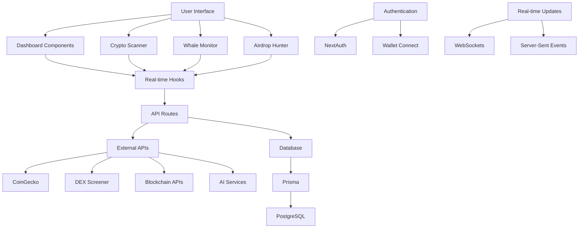
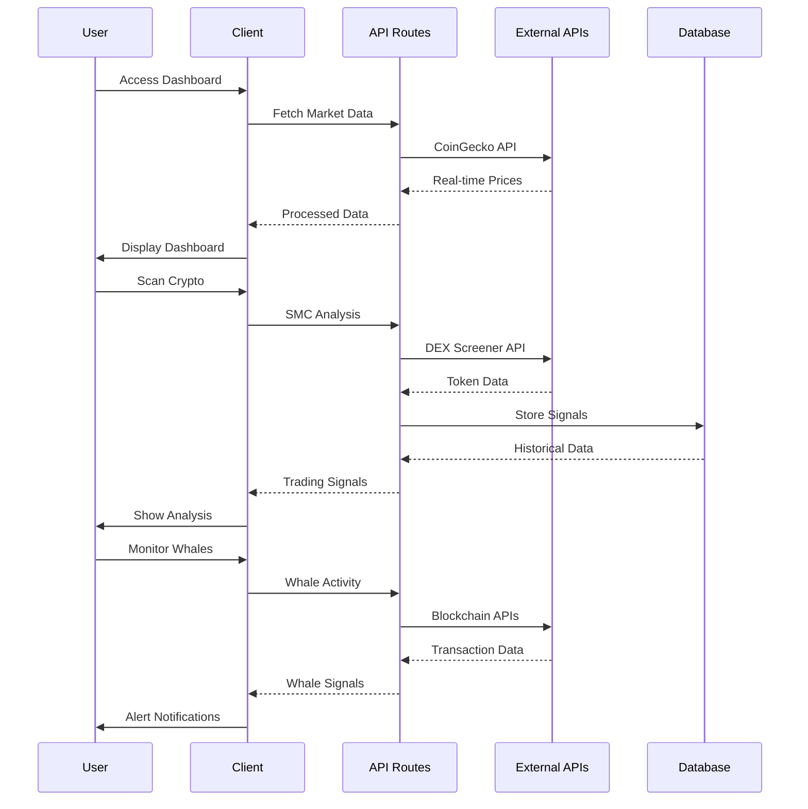

# Hollowcat Trading Platform Implementation Plan

## Project Overview

Hollowcat is a professional institutional trading platform built on top of the WhaleRadar AI project. It extends the existing crypto scanner with a complete Smart Money Concepts (SMC) trading decision system.

## Architecture

### Core Engine Modules (`lib/hollowcat/`)

| Module | File | Description |
|--------|------|-------------|
| Types | `types.ts` | All type definitions for the platform |
| Trend Engine | `trend-engine.ts` | EMA200 + Kalman Filter + Adaptive Regression + Slope + ATR |
| Market Structure | `market-structure-engine.ts` | HH/HL/LH/LL, BOS, CHoCH detection |
| FVG Engine | `fvg-engine.ts` | Fair Value Gap detection with state tracking |
| Order Block Engine | `order-block-engine.ts` | Bullish/Bearish OB detection |
| Liquidity Engine | `liquidity-engine.ts` | Buy/Sell side liquidity, sweeps, stop hunts |
| Volume Engine | `volume-engine.ts` | Volume spike, relative volume, confirmation |
| Regression Engine | `regression-engine.ts` | Adaptive regression channel with Kalman |
| Probability Engine | `probability-engine.ts` | Weighted LONG/SHORT probability scoring |
| Risk Engine | `risk-engine.ts` | Entry, SL, TP1/TP2/TP3, expected RR |
| Entry Engine | `entry-engine.ts` | Multi-condition entry signal determination |
| Quality Engine | `quality-engine.ts` | Trade rating A+ to AVOID |
| Backtest Engine | `backtest-engine.ts` | Win rate, profit factor, Sharpe, drawdown |
| Alert Engine | `alert-engine.ts` | TradingView, Webhook, Telegram, Discord |
| Dashboard Engine | `dashboard-engine.ts` | Unified dashboard data aggregation |
| Strategy Engine | `strategy-engine.ts` | Multi-timeframe strategy orchestration |
| Index | `index.ts` | Main export file |

### API Routes (`app/api/hollowcat/`)

- `route.ts` - Main Hollowcat analysis endpoint (POST/GET)

### Frontend Components (`components/hollowcat/`)

| Component | Description |
|-----------|-------------|
| `HollowcatDashboard.tsx` | Main dashboard with KPI cards and all indicators |
| `HollowcatChart.tsx` | Chart with confidence-based candle coloring |
| `HollowcatSignals.tsx` | Signal panel with probability scores and reasons |
| `HollowcatRiskPanel.tsx` | Risk management panel with RR visualization |
| `HollowcatAlerts.tsx` | Alert configuration and history |
| `HollowcatBacktest.tsx` | Backtest results and trade history |
| `HollowcatTradeQuality.tsx` | Trade quality rating with factor breakdown |
| `HollowcatEntryEngine.tsx` | Entry engine with decision reasons |

### Page (`app/hollowcat/page.tsx`)

Main Hollowcat dashboard page with tab navigation.

## Key Features

### Probability-Based Signals
- LONG Probability (0-100%)
- SHORT Probability (0-100%)
- Confidence Score
- Trade Quality Rating (A+ to AVOID)
- Expected Risk-Reward Ratio

### Weighted Probability Scoring
- Trend: 20%
- Volume: 15%
- Liquidity: 15%
- Structure: 15%
- Regression: 10%
- FVG: 10%
- Order Block: 10%
- Momentum: 5%
- ATR: 5%
- VWAP: 5%

### Candle Color Coding
- Dark Green: Very Strong Long (confidence > 80%)
- Light Green: Moderate Long (confidence 60-80%)
- Gray: Neutral (confidence < 60%)
- Orange: Moderate Short (confidence 60-80%)
- Red: Strong Short (confidence > 80%)

### Entry Engine Rules
- Trend must be confirmed
- BOS must be confirmed
- Liquidity must be confirmed
- Fresh FVG available
- Volume confirmation
- Minimum probability above threshold (60%)
- Otherwise: WAIT or NO TRADE

### Alert Channels
- TradingView Alerts
- Webhook
- Telegram
- Discord

### Backtesting Metrics
- Win Rate
- Profit Factor
- Expectancy
- Sharpe Ratio
- Sortino Ratio
- Max Drawdown
- Recovery Factor

## Implementation Architecture

## Data Flow Diagram

## Implementation Priority Order

### Phase 1: Foundation (High Priority)
1. **Environment Setup**
   - Create `.env` with API keys
   - Configure database connection
   - Set up Prisma migrations

2. **External API Integration**
   - CoinGecko for market data
   - DEX Screener for token data
   - Blockchain explorers for whale data

### Phase 2: Core Features (Medium Priority)
3. **Real-time Data Pipeline**
   - WebSocket connections
   - Real-time dashboard updates
   - Live signal generation

4. **Authentication & Wallet**
   - Complete NextAuth setup
   - Fix wallet integration
   - User session management

### Phase 3: Advanced Features (Low Priority)
5. **AI Signal Generation**
   - SMC engine with real data
   - Machine learning integration
   - Automated trading signals

6. **Deployment & Monitoring**
   - Vercel configuration
   - Performance monitoring
   - Error tracking

## Detailed Implementation Steps

### 1. Environment Configuration
- Create `.env` file with required keys:
  - `DATABASE_URL`
  - `NEXTAUTH_SECRET`
  - `GOOGLE_CLIENT_ID/SECRET`
  - `NEXT_PUBLIC_WALLETCONNECT_PROJECT_ID`
  - External API keys

### 2. Database Setup
- Run Prisma migrations
- Seed initial data
- Set up database relationships

### 3. API Route Implementation
- Replace mock data with real API calls
- Add error handling and rate limiting
- Implement caching strategies

### 4. Real-time Features
- WebSocket server setup
- Client-side real-time hooks
- Live dashboard updates

### 5. Authentication Flow
- Complete NextAuth configuration
- Wallet connection integration
- User profile management

### 6. Testing & Deployment
- API endpoint testing
- Performance optimization
- Production deployment

## Technical Requirements

### External APIs Needed
1. **CoinGecko API** - Market data, prices, volumes
2. **DEX Screener API** - Token data, liquidity, trends
3. **Blockchain Explorers** - Ethereum, Solana, etc.
4. **AI Services** - Signal generation, analysis

### Database Schema Enhancements
- User preferences and watchlists
- Signal history and performance
- Airdrop tracking data
- Wallet connection records

### Performance Considerations
- API rate limiting
- Data caching strategies
- Real-time update optimization
- Error handling and fallbacks

## Success Metrics

- ✅ All dashboard widgets show real data
- ✅ Real-time updates work correctly
- ✅ Authentication flows function properly
- ✅ Wallet connections are stable
- ✅ Signal generation uses live market data
- ✅ Airdrop tracking shows real campaigns

This plan provides a clear roadmap for implementing missing features and connecting real data sources to your WhaleRadar AI platform.